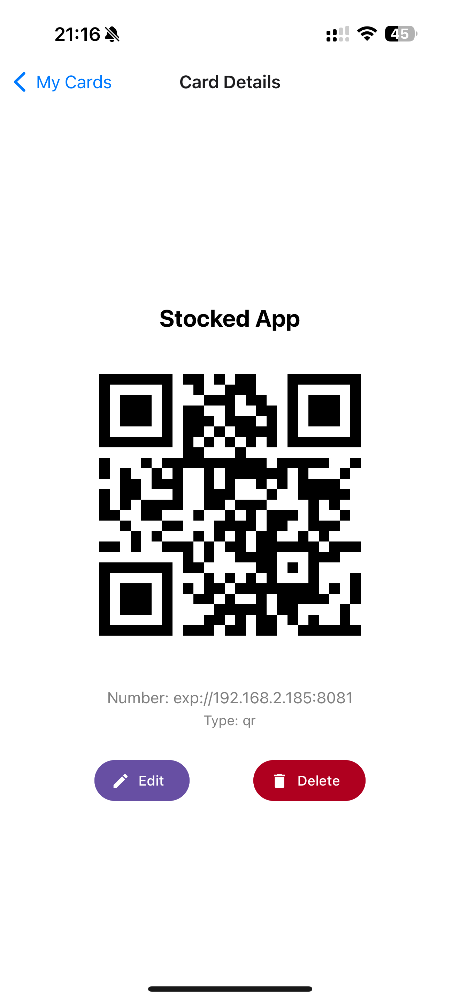
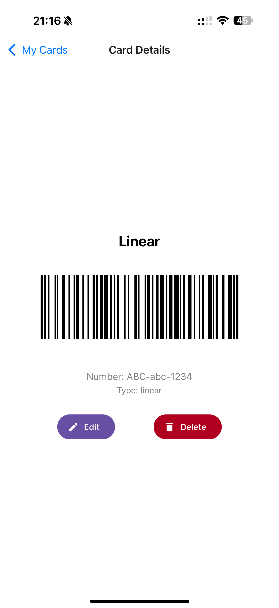
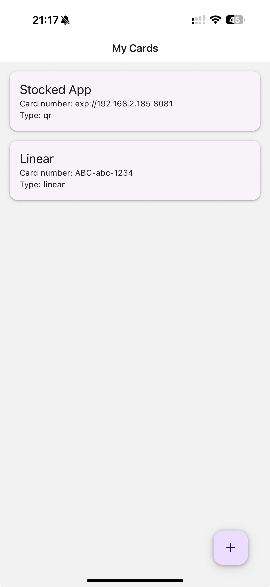

# Stocard (Tribute)

This project is a personal endeavor born out of nostalgia for the original Stocard app before its acquisition and subsequent changes. I missed the simplicity and functionality of the old app and decided to recreate some aspects of it for my own use and learning.

**Disclaimer:** This project is purely for educational and personal purposes. It is not intended to infringe on any trademarks or copyrights held by Klarna or the original Stocard developers. I mean no harm, and I kindly request Klarna not to pursue legal action regarding this hobby project.

## Screenshots

<div align="center">
  <table>
    <tr>
      <td align="center">
        
        <br />
        <em>Card List Screen</em>
      </td>
      <td align="center">
        
        <br />
        <em>Card Detail View</em>
      </td>
      <td align="center">
        
        <br />
        <em>Barcode Scanner</em>
      </td>
    </tr>

  </table>
</div>

## Features

- Scan and store loyalty cards and membership barcodes
- Easily access your cards with a simple, clean interface
- Works offline - no internet connection required to use your cards

## Local Installation

To run this project locally, follow these steps:

1. **Clone the repository:**

   ```bash
   git clone https://github.com/paulcfo/stocard.git
   cd stocard
   ```

2. **Install dependencies:**

   ```bash
   yarn install
   ```

3. **Start the development server:**

   ```bash
   yarn expo start
   ```

4. **Run on your device/simulator:**
   - For iOS: Press `i` in the terminal or scan the QR code with your camera app
   - For Android: Press `a` in the terminal or scan the QR code with the Expo Go app

## Building for Production

To create a standalone build:

```bash
# For iOS
eas build --platform ios --profile production

# For Android
eas build --platform android --profile production
```

## Requirements

- Node.js (v16 or newer)
- Yarn package manager
- iOS Simulator (for iOS development) or Xcode
- Android Studio and Android SDK (for Android development)
- Expo Go app on your physical device (if testing on a real device)

## Development

This is a React Native application built with Expo. The project uses TypeScript for type safety and better development experience.
